class: middle
##Bem-vindos!!!


- O curso, Introdução ao software R: Aplicações na área da saúde, objetiva capacitar os funcionários e gestores da Secretaria da Saúde do Estado de Goiás para que eles possam desenvolver melhor as suas atividades. 

- O curso também será aberto para outros profissionais liberais da área da saúde, incluindo alguns docentes, discentes e pesquisadores da Escola de Medicina da Universidade Federal de Goiás.


---
class: middle
##Programação:

.pull-left[
Dia 1:

- Introdução ao GitHub / Comentários sobre sistemas operacionais;

- Introdução ao software R;

- Introdução ao ambiente de desenvolvimento integrado RStudio.


Dia 2:

- Manipulação / Visualização de dados.

- Medidas Resumo com software R.

]


.pull-right[
Dia 3:

- Intervalos de Confiança

- Testes de Comparação de Médias

- Análise de Variância com 1 fator

- Análise de Correlação

- Testes Não Paramétricos para comparar dois grupos 

- Testes Não Paramétricos para comparar mais de dois grupos 

Dia 4:

- Estudo de Caso
]

Obs: O cronograma pode mudar de acordo com a necessidades dos participantes.

---
class: middle
##Introdução ao GitHub

###Git 
- Git é um sistema de **controle de versão** desenvolvido por Linus Torvalds (HOSTINGER, 2015?).

###Controle de versão

- Controle de versão permite o acompanhamentio de mudanças feitas no código-fonte. 

- Também registra quem efetuou a mudança e possibilita a restauração do código removido ou modificado.

- Não há códigos sobrescritos uma vez que o Git salva múltiplas cópias no repositório (HOSTINGER, 2015?).


---
class: middle
##Introdução ao GitHub


###Git versus GitHub

- Simplificando, Git é um sistema de controle de versão que permite gerenciar e controlar o histórico do código-fonte (DEVMOUNTAIN BLOG, 2015?)


- GitHub é um serviço de hospedagem baseado em nuvem que permite gerenciar repositórios Git. Se você tiver projetos de código aberto que usam Git, o GitHub foi projetado para ajudá-lo a gerenciá-los melhor (DEVMOUNTAIN BLOG, 2015?).

###Informações Adicionais

- Nesse curso, vamos focar em ensinar como baixar arquivos a partir do GitHub.

- Maiores detalhes de como usar o GitHub foge do escopo desse curso, mas quem tiver interesse é só [clicar aqui](https://www.hostinger.com.br/tutoriais/tutorial-do-git-basics-introducao/).

---
##Como baixar arquivos do GitHub

- Digite no seu web browser o seguinte endereço:
https://github.com/renatorrsilva/R_Saude:


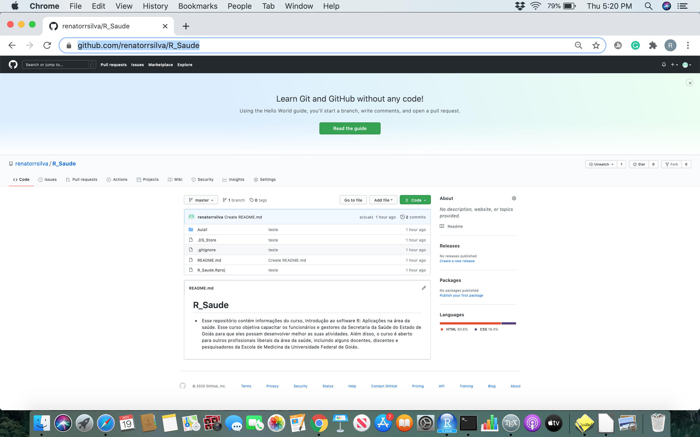

---
##Como baixar arquivos do GitHub

- Clique na janela Code em verde

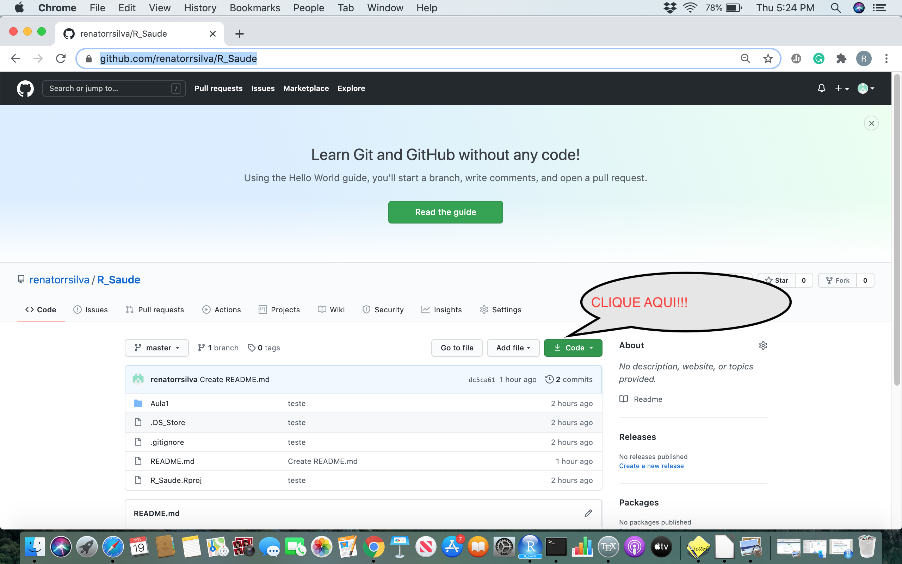

---
##Como baixar arquivos do GitHub

- Clique no botão Downloads.ZIP

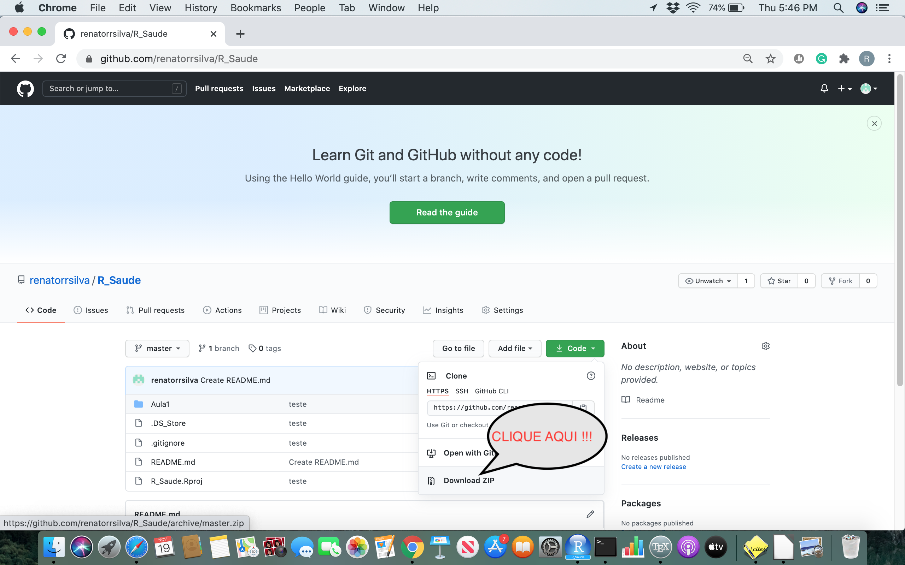


---
class: middle
##Breve resumo sobre sistemas operacionais

###O que é sistema operacional

- "É um software ou conjunto de softwares cuja função é administrar  os recursos de um sistema, estabelecendo a **interface entre o computador e o usuário**" (TECNOBLOG, 2020?).

- Como exemplo temos: Microsoft Windows, Mac OS X e Linux.

- Veremos que ao longo do curso, alguns aspectos relacionados a instalação de softwares pode ser diferente para cada sistema operacional. No entanto, as linhas de comando do software R são as mesmas, independendo do sistema operacional a ser usado.

- Maiores detalhes sobre sistema operacional, [clique aqui](https://edu.gcfglobal.org/pt/informatica-basica/sistemas-operacionais-para-o-computador/1/) (GCF APRENDE LIVRE, 2020?).


---
class: middle
##Breve resumo sobre sistemas operacionais

###Caminho

Um caminho, do inglês path, é a forma geral do nome de um arquivo ou diretório, especifica uma localização única em um sistema de arquivos (WIKIPEDIA, 2000?).

Exemplos: 

- Nome do diretório onde está localizado o arquivo dessa aula.

/Users/renatorodriguessilva/Dropbox/UFG/extensao/R_Saude/Aula1.

---
class: middle

###Caminho absoluto 

- Um caminho absoluto  aponta para a mesma localização em um sistema de arquivos, independentemente do diretório de trabalho atual (WIKIPEDIA, 2000?). Para fazer isso, é necessário incluir o diretório raiz (WIKIPEDIA, 2000?).

###Caminho relativo

- Um caminho relativo inicia a partir de algum diretório de trabalho fornecido, evitando a necessidade de fornecer o caminho absoluto completo (WIKIPEDIA, 2000?).

- Um nome de arquivo pode ser considerado como um caminho relativo baseado no diretório de trabalho atual (WIKIPEDIA, 2000?).

###IMPORTANTE !!!

- Se o diretório de trabalho não for o diretório pai do arquivo (onde o arquivo está localizado), resultará em um erro de arquivo não encontrado se o arquivo for endereçado pelo seu nome (WIKIPEDIA, 2000?).


---
class: middle
##Breve resumo sobre sistemas operacionais

###Caminhos no Windows (DOS tradicional)

Um caminho DOS é composto de: 

- Volume ou letra da unidade seguido pelo separador $:$ (dois pontos), 

- Um nome de diretório, o caractere separador de diretório $\$ (barra), separa subdiretórios dentro de uma hierarquia aninhada de diretório.

- Um nome de arquivo opcional.  o caractere separador de diretório $\$ (barra) separa o caminho do arquivo e o nome do arquivo. 

---
class: middle
##Breve resumo sobre sistemas operacionais


Exemplos:

a.  C:\Documents\Newsletters\Summer2018.pdf, 

- Esse é um  caminho de arquivo absoluto da raiz da unidade C: 

b.  2018\January.xlsx

- Um caminho relativo para um arquivo em um subdiretório do diretório atual.

###IMPORTANTE !!!

- Caminhos declarados de foma incorreta  é uma das maiores fontes de erros durante o aprendizado de softwares estatísticos, principalmente no que tange a leitura dos dados.

- Minha dica é: Aponte o software para um diretório, coloque seus arquivos neste diretório e sempre use apenas o nome do arquivo como caminho relativo.

- Para achar caminho de um arquivo no Windows, [clique aqui](https://pt.wikihow.com/Encontrar-o-Caminho-de-um-Arquivo-no-Windows).

---
class: middle
##Breve resumo sobre sistemas operacionais

###Caminhos no Linux / Mac OS X

- Caminho absoluto: Todo caminho absoluto inicia no diretório raiz (/), por exemplo: /home/aluno, a partir do qual, todos caminhos absolutos derivam, formando uma árvore de diretórios. 

- A vantagem dos caminhos absolutos é poder identificar arquivos.

---
class: middle

##Breve resumo sobre sistemas operacionais

###Caminhos no Linux / Mac OS X

- Caminho relativo: Todo caminho relativo não contém uma 'barra' no início. A referência é geralmente o diretório atual (pwd) onde o shell se encontra .

- Em caminhos relativos é possível utilizar outros atalhos como: 

-  ~ til, que referenciam o diretório pessoal. Por exemplo, ls ~/Downloads lista a pasta
Downloads da pasta pessoal do usuário atual.

- $.$ ponto, que significa o diretório atual. Por exemplo, ./run-app, executa o arquivo runapp que está localizado no diretório atual.

- $..$ dois-pontos, que significa o diretório pai. Por exemplo, cd .., muda para o diretório
pai. 

- Maiores detalhes, [clique aqui](https://wiki.sj.ifsc.edu.br/images/4/42/Comandos_B%C3%A1sicos.pdf) (FONTANA & CASTRO, 2014).

---
class: middle

##Breve resumo sobre sistemas operacionais

###Caminhos no Linux / Mac OS X

####Exemplos

/home/bohlke/programas/testes/arquivo1.blah

é um caminho absoluto para o arquivo. Pode-se alcançar o arquivo1.blah independendo do diretório atual.

programas/teste/arquivo1.blah

é um caminho relativo para o mesmo arquivo. Só se pode alcançá-lo se estivermos previamente em /home/bohlke.

Maiores informações sobre uso do terminal do Linux / Mac OS X [clique aqui](https://www.linux.ime.usp.br/~lucasmmg/livecd/documentacao/documentos/terminal/Terminal_basico.html).


---
class: middle

##Introdução ao software R

###O que é R?

- R é um ambiente de software livre para computação estatística e gráficos. Compila e roda em uma ampla variedade de plataformas UNIX, Windows e MacOS (HORNIK 2020). 

##O que é CRAN?

- A “Rede Comprehensive R Archive” (CRAN) é uma coleção de sites que carregam material idêntico, consistindo na (s) distribuição (ões) R, as extensões contribuídas, documentação para R e arquivos binários (HORNIK 2020).


---
class: middle

##Instalação do software R no Windows


a. Digite no google a palavra CRAN

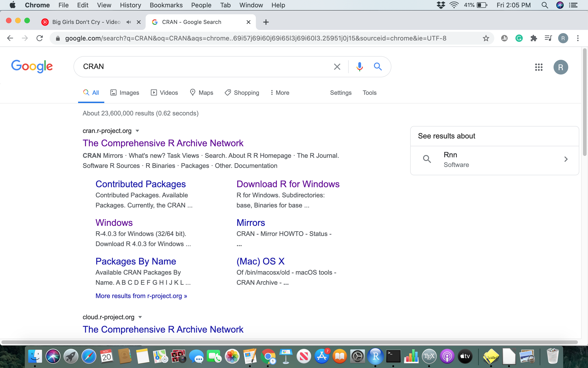


---
class: middle

##Instalação do software R no Windows

b.  Entre na página https://cran.r-project.org/


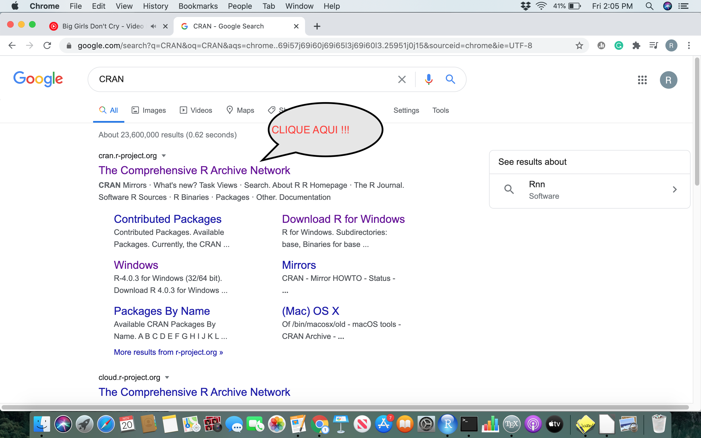

---
class: middle

##Instalação do software R no Windows

c. Clique em Download R for Windows

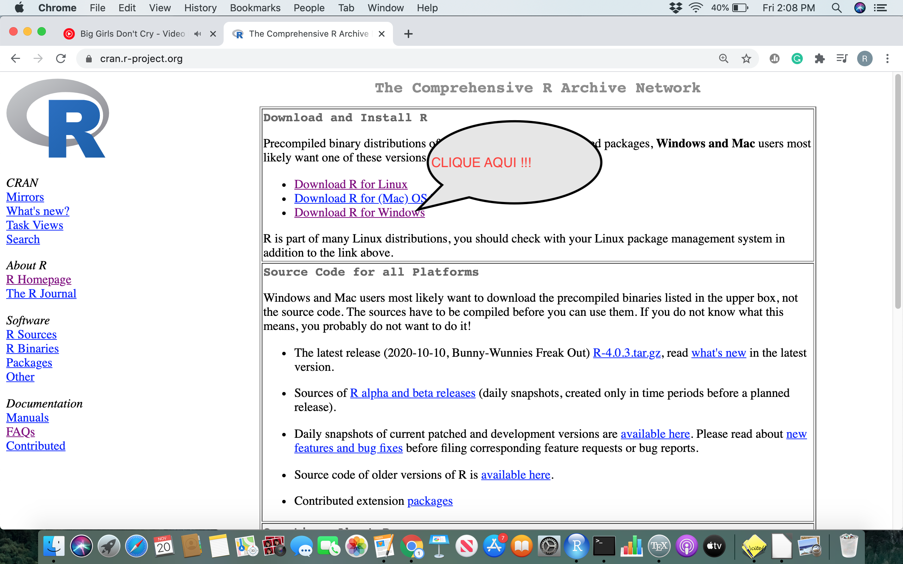


---
class: middle

##Instalação do software R no Windows

d. Clique em install R for the first time


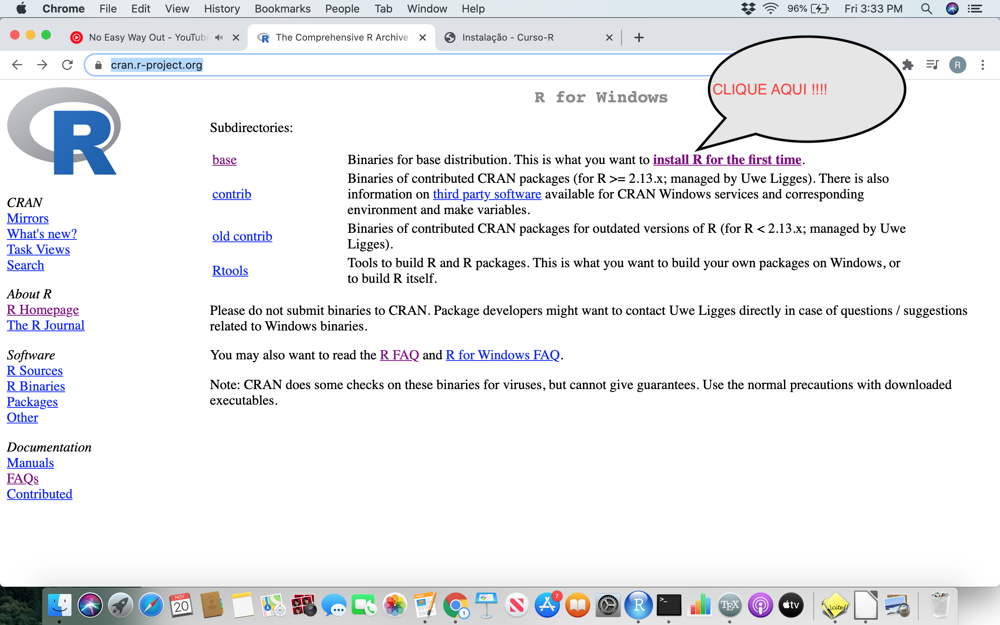


---
class: middle

##Instalação do software R no Windows

e. Clique em install Download R.4.0.3 for Windows e de


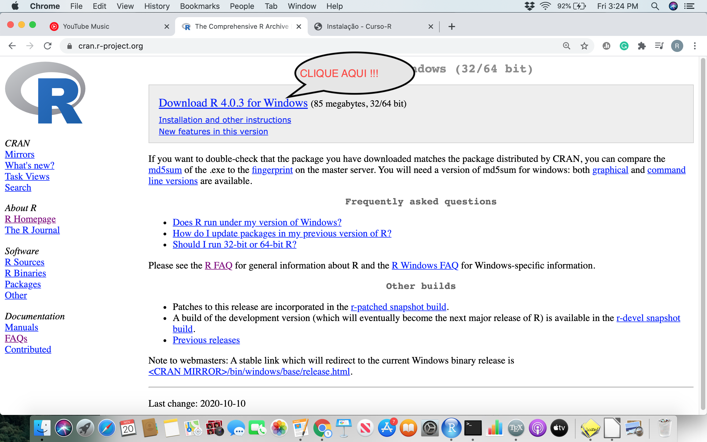


---
class: middle

##Instalação do software R no Windows

- Clique no arquivo duas vezes com o botão esquerdo. Ele pedirá para você selecionar a linguagem da instalação. Escolha um idioma e clique em “OK (CURSO R, 2018?)”.

- Em seguida, clique em “Avançar” até chegar na tela da imagem abaixo. Nessa etapa, você precisará escolher a pasta de instalação (CURSO R, 2018?). 

- Se você escolher um local que não está dentro da pasta do seu usuário, você precisará de acesso de administrador. Se escolher uma pasta dentro do seu usuário (como na imagem abaixo), não precisará (CURSO R, 2018?).

- Continue clicando em “Avançar” e, ao fim da instalação, em “Concluir”.


---
class: middle

##Instalação do software R no Mac OS X


a. Clique no arquivo que contém a versão mais recente do R em “Arquivos”.


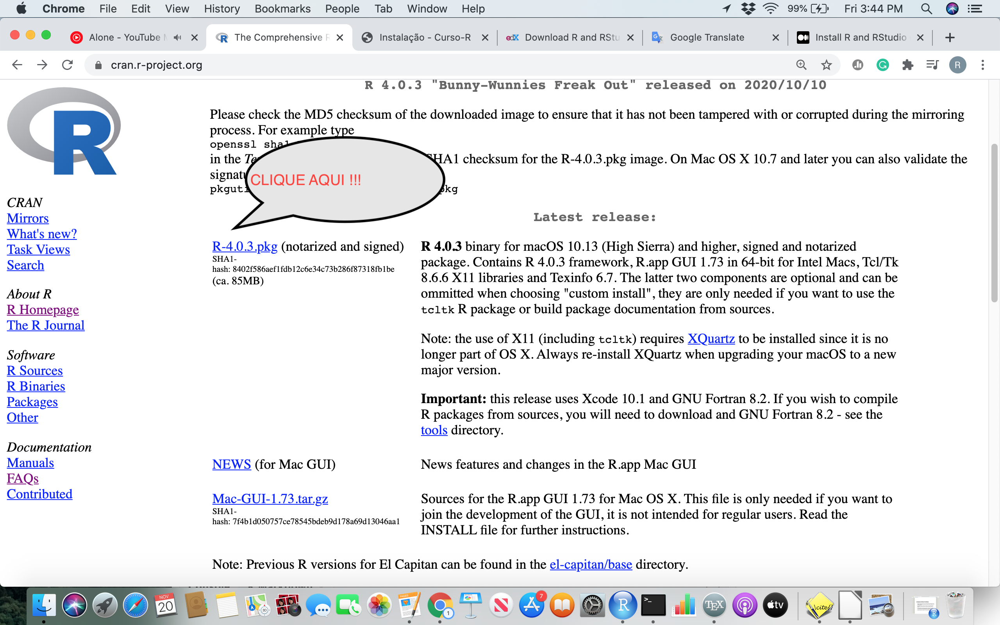


---
class: middle

##Instalação do software R no Mac OS X

b. Salve o arquivo .pkg, clique duas vezes nele para abri-lo e siga as instruções de instalação.


c. Agora que o R está instalado, você precisa baixar e instalar o RStudio.


---
class: middle

##Instalação do software R Studio - Windows

- Acesse o endereço https://rstudio.com/

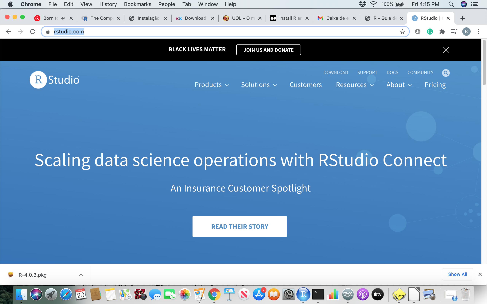


---
class: middle

##Instalação do software R Studio - Windows

- Passe o mouse na palavra Products

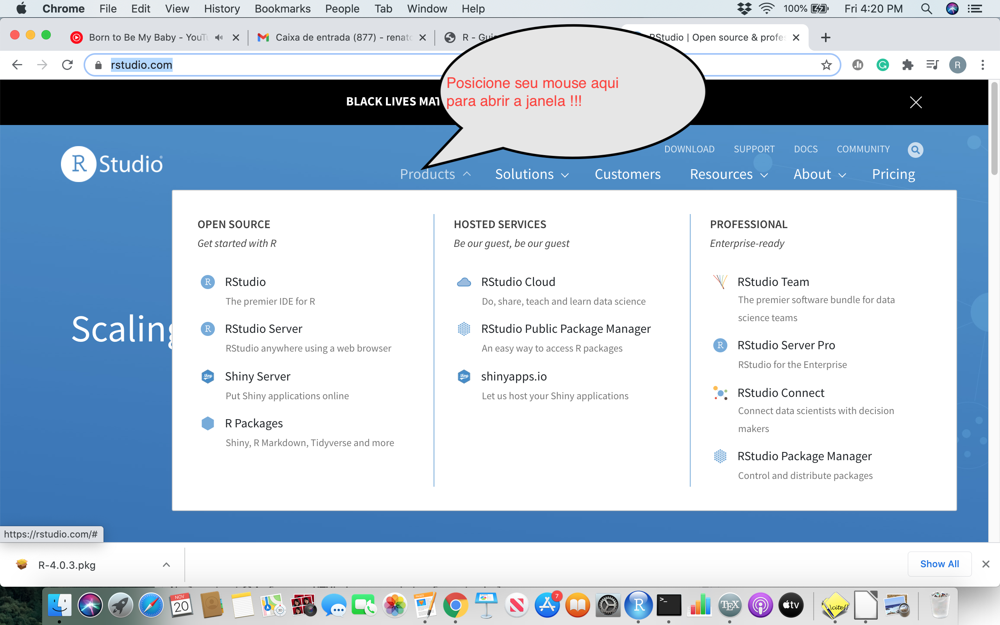

---
class: middle

##Instalação do software R Studio - Windows


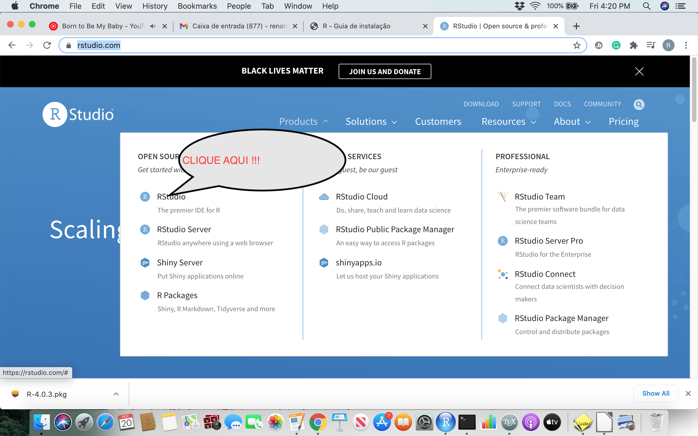

---
class: middle

##Instalação do software R Studio - Windows


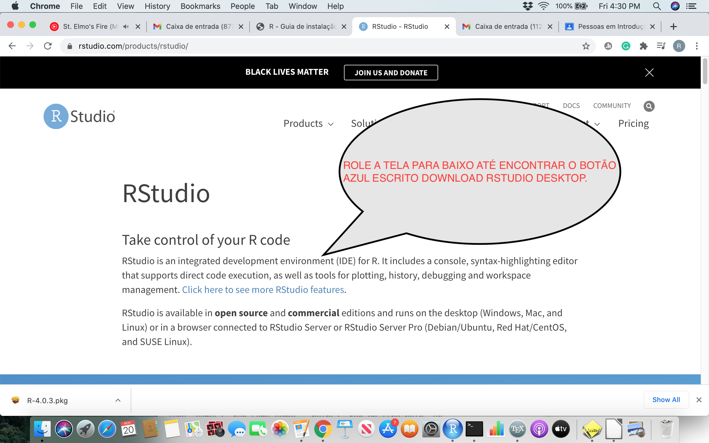

Será exibida uma página com a recomendação para você baixar o RStudio  Windows 10/8/7 

---
class: middle

##Instalação do software R Studio - Mac OS X

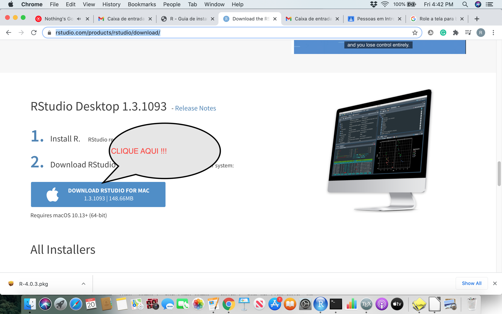

Dúvidas sobre instalação, [clique aqui](http://leg.ufpr.br/~fernandomayer/aulas/ce083-2016-2/R-instalacao.html).


---
class: middle

##Layout R Studio 

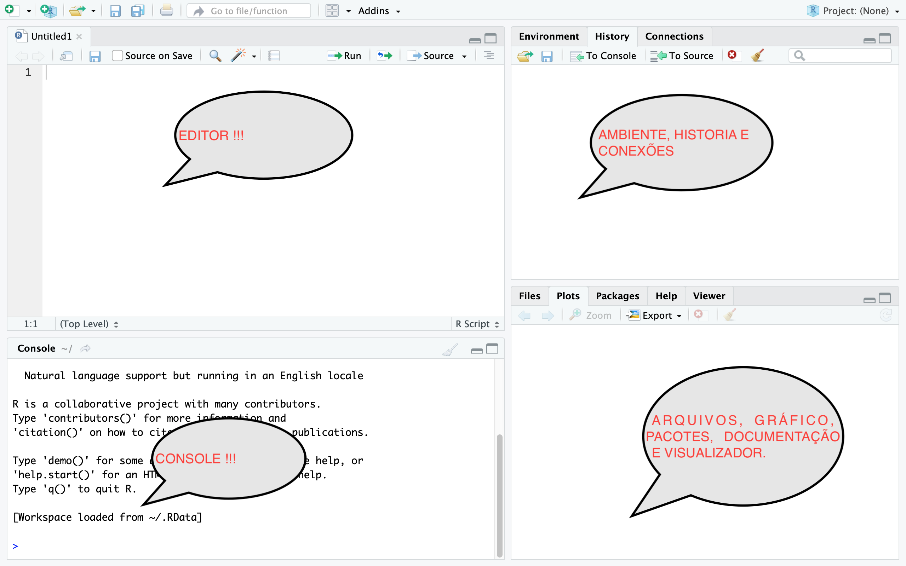

---
class: middle

##Layout R Studio 

###Editor

- Local para escrever os códigos. Pode-se executar script de duas formas: (1) através do ícone "Run"; ou através do atalho "ctrl + enter".

- Para salvar o script em um arquivo clique no ícone do disquete.


###Console

- Local os comandos são executados. Como R é uma linguagem interpretada, os comandos aparecem instantâneamente. 

- É possível executar comandos diretamente no console.


---
class: middle

##Layout R Studio 

###Ambiente

- Mostra os objetos, dados e variáveis criadas.

###Históricos

- Local onde armazenado seu histórico do script.

###Conexões

- Aba relacionada a bases de dados. Dificilmente, vamos usar aqui.

- Interessados em maiores detalhes, [clique aqui](https://db.rstudio.com/rstudio/connections/)


---
class: middle

##Layout R Studio 

###Arquivos:

- Endereço do seu diretório de trabalho, ou seja, do diretório no qual você está trabalhando. Comando `getwd()` imprime o diretório de trabalho. Comando `setwd()` define o diretório de trabalho.

###Gráficos:

- É a aba onde o gráfico vai aparecer

###Pacotes:

- É a aba onde aparece uma lista de pacotes que você pode selecionar e instalar na hora. O comando `install.packages()` instala pacotes de modo mais direto.

---
class: middle

##Layout R Studio 


###Documentação:

- É a aba onde aparece a documentação com exemplos e explicações sobre alguma função que você possa ter dúvidas de como utilizar. Use o comando `?` para pedir ajuda.


###Visualizador

- A aba "Viewer" é utilizada para  visualização de arquivos interativos produzidos.


---
class: middle

##Comandos básicos


```{r}
#Adição
2 + 2 

#Subtração
5 - 10

#Multiplicação
3 * 2

#Divisão
80 / 100

```


---
class: middle

##Comandos básicos


```{r, echo=TRUE}
#Potenciação
10^2

#Raiz Quadrada 
sqrt(100)

#Logaritmo de 100 na base 10, Logaritmo Natural
log10(100); log(100) 

#Função exponencial
exp(100)

```


---
class: middle

##Comandos básicos

```{r}

#Note que
-8^(1/3); (-8)^(1/3)

#Operação módulo - Restante da divisão Euclideana
5 %% 3 

```


---
class: middle

##Comandos básicos


```{r}
#Valores absolutos
abs(-4)

#Valores absolutos
abs(4)

```


---
class: middle

##Comandos básicos

```{r}

#cosseno
cos(90); cos(pi/2)

#seno
sin(90); sin(pi/2)

#tangente
tan(45); tan(pi/4)


```


---
class: middle

##Tipos de dados/ objetos báscico: numérico, caracteres and lógicos


```{r}

#Numérico

minha_idade = 38

minha_idade

#Caracteres

meu_nome = "Renato"

meu_nome

```

---
classe: middle

###Tipos de objetos: numéricos, caracteres and lógicos

```{r}

###Trabalha na área da saúde (sim/não) <=> (TRUE/FALSE)

is_saude = TRUE # variável lógica

is_saude

```


###Vetores: uma combinação de valores múltiplos (numéricos, caracteres ou lógicos)


```{r}

idades = c(27, 25, 29, 26)

idades

```


---
class: middle

##Vetores e atribuição

- Atribuição pode ser também feito com a função can also be made using the function `assign()`. 


```{r}
assign("x", c(10.4, 5.6, 3.1, 6.4, 21.7))
x
```

---
class: middle

##Vetores e reciclagem no R


- R gosta de operar em vetores do mesmo comprimento,

- Portanto, se ele encontrar dois vetores de comprimentos diferentes em uma operação binária,

- Ele simplesmente replica o vetor menor até que tenha o mesmo comprimento do vetor mais longo e, então, faz a operação.

- Se o vetor menor reciclado tiver que ser "cortado" para torná-lo do comprimento do vetor mais longo, você receberá um aviso, mas ainda retornará um resultado:

---
class: middle

##Vetores e reciclagem no R


```{r}
x <- c(1,2,3)
y <- c(1,10)

x * y
```


---
class: middle

##Reciclagem em outros contextos


```{r}

x = 1:20

x * c(1,0) 

```


---
class: middle

##Reciclagem em outros contextos


```{r}

x * c(0, 0, 1) 

x < ((1:4)^2) 

1/x

```


---
class: middle 

##Geração de sequência regulares

- Existem muitas maneiras de gerar uma sequência. Por exemplo,

```{r}
1:10
```

```{r}
10:1
```

```{r}
(1/2):5 
```

---
class: middle 

##Geração de sequência regulares

```{r}
seq(-5, 5, by=.2) 
```


```{r}
seq(length=20, from=-5, to=5)
```

---
class: middle 

##Geração de sequência regulares

```{r}

rep(1:5, times=5)
```


```{r}
rep(1:5, each=5)
```

```{r}
rep(c(1,4,3), c(2,7,6))
```


---
class: middle

##Valores faltantes

- Em alguns casos, os componentes de um vetor podem não ser completamente conhecidos.

- Quando um elemento ou valor “não está disponível” ou um “valor ausente” no sentido estatístico, um lugar dentro de um vetor pode ser reservado para ele atribuindo-lhe o valor especial `NA`.

- Em geral, qualquer operação em um `NA` torna-se um` NA`.

- A motivação para esta regra é simplesmente que se a especificação de uma operação estiver incompleta, o resultado não pode ser conhecido e, portanto, não está disponível.

- A função `is.na (x)` fornece um vetor lógico do mesmo tamanho que `x` com valor` TRUE` se e somente se o elemento correspondente em `x` for` NA`.

---
class: middle

##Valores faltantes


- Observe que há um segundo tipo de valores “perdidos” que são produzidos por cálculo numérico, os chamados valores Não um Número, 'NaN'. Exemplos são


```{r}
0 / 0
```

```{r}
Inf - Inf
```


---
class: middle

##Data frames

- Um `data.frame` é uma lista com a classe "data.frame". Existem restrições nas listas que podem ser feitas em frames de dados, nomeadamente

- Os componentes devem ser vetores (numéricos, caracteres ou lógicos), fatores, matrizes numéricas, listas ou outros quadros de dados.

- Matrizes, listas e quadros de dados fornecem tantas variáveis para o novo quadro de dados quantas colunas, elementos ou variáveis têm, respectivamente.

- Vetores numéricos, lógicos e fatores são incluídos no estado em que se encontram e, por padrão, os vetores de caracteres são coagidos a serem fatores, cujos níveis são os valores únicos que aparecem no vetor.

- As estruturas vetoriais que aparecem como variáveis do quadro de dados devem ter o mesmo comprimento e as estruturas matriciais devem ter o mesmo tamanho de linha.

---
class: middle

##Fazendo data.frames


```{r}

dat = data.frame(student = c("Renato", "Joao", "Pedro", "Maria", "Joana"), grades = c(10,2,4,9,9.5), approved = c(T,F,F,T,T))

dat

```


---
class: middle

##Configurando diretório de trabalho

- Antes de ler quaisquer dados, você deve definir o diretório de trabalho R para o local dos dados (SAMHDA, 2017?).

- `setwd (“… ”)` definirá o diretório de trabalho atual para um local específico

- `getwd ()` imprimirá o diretório atual.

- `> setwd (" C: / mydata ")` (Windows)


** Definir o diretório de trabalho corretamente pode eliminar a confusão de caminho. **


 
---
class: middle

##Lendo dados de arquivos

- Ler dados em um sistema estatístico para análise e exportar os resultados para algum outro sistema para escrever relatórios podem ser tarefas frustrantes.

- Às vezes, leva muito mais tempo do que a própria análise estatística, embora a maioria dos leitores ache esta última muito mais atraente.

- A função `read.table` é a maneira mais conveniente de ler em uma grade retangular de dados.

- Por causa das muitas possibilidades, existem várias outras funções que chamam `read.table`, mas alteram um grupo de argumentos padrão.

- Esteja ciente de que read.table é uma maneira ineficiente de ler matrizes numéricas muito grandes.

---
class: middle

## Lendo Arquivos de Dados Delimitados - Delimitado por Espaço

Função: `read.table ()`

Parâmetros comuns:

- File:o nome do arquivo do qual os dados devem ser lidos.

- Header: TRUE quando a primeira linha inclui nomes de variáveis. O default é falso.


- Sep:Uma string indicando o que está separando os dados. O default é 


'> dataSPACE <-read.table("C:/mydata/survey.dat", header=TRUE, sep= " ")'

or

'> dataSPACE <-read.table("C:/mydata/survey.txt", header=TRUE, sep= " ")'

---
class: middle

## Lendo Arquivos de Dados Delimitados - Delimitado por Tabulação

Função: `read.table()`

Exenplo:

`> dataTAB <-read.table("survey.dat", header=TRUE, sep= "\t")`

ou 

`> dataTAB <-read.table("survey.txt", header=TRUE, sep= "\t")`


---
class: middle

## Lendo Arquivos de Dados Delimitados - Delimitado por Tabulação

```{r}

dat = read.table("Goiaba.txt",header = TRUE)

head(dat)

#View(dat)

```

---
class: middle

## Lendo Arquivos de Dados Delimitados - Delimitado por Tabulação

```{r}

dat = read.table("tabela2.1.csv", sep=";",header = TRUE)

head(dat)

#View(dat)

```


---
class: middle

## Lendo arquivos delimitados por vírgulas

- `read.csv ()` lê arquivos delimitados por vírgulas,

- `read.csv2 ()` lê arquivos separados por ponto e vírgula (comum em países onde, é usado como a casa decimal).


---
class: middle

## Lendo arquivos delimitados por vírgulas

```{r}

dat = read.csv("student-por.csv",header = TRUE)

head(dat)

```


---
class: middle

## Lendo arquivos delimitados por vírgulas

```{r}

dat = read.csv2("tabela2.1.csv",header = TRUE)

head(dat)

```


---
##Referências 


- O Que é GitHub e para que é usado?. HOSTINGER [2015?]. Disponível em: <https://www.hostinger.com.br/tutoriais/o-que-github//>. Acesso em: 19 de nov. de 2020.

- The Devmountain blog, DEVMOUNTAIN [2015?]. Disponível em: <https://blog.devmountain.com/git-vs-github-whats-the-difference/#:~:text=GitHub%E2%80%A6-,what's%20the%20difference%3F,help%20you%20better%20manage%20them.> Acesso em: 19 de nov. de 2020.

- GOGONI, R. O que é um sistema operacional? Tecnoblog. Disponível em: <https://tecnoblog.net/303055/o-que-e-um-sistema-operacional/>. Acesso em: 20 de nov. de 2020.

- GCFAprendeLivre. Informática Básica - Sistemas operacionais para o computador. Disponível em: <https://edu.gcfglobal.org/pt/informatica-basica/sistemas-operacionais-para-o-computador/1/>. Acesso em: 20 de nov. de 2020.


---
##Referências

- Caminho (computação). WIKIPEDIA [2000?].Disponível em:
<https://pt.wikipedia.org/wiki/Caminho_(computa%C3%A7%C3%A3o).> Acesso em: 20 de nov. de 2020.

-  Formatos de caminho de arquivo em sistemas Windows. MICROSOFT [2000?]. Disponível em: <https://docs.microsoft.com/pt-br/dotnet/standard/io/file-path-formats>.
Acesso em: 20 de nov. de 2020.

- Como Encontrar o Caminho de um Arquivo no Windows. wikiHow [2020?].
Disponível em: <https://pt.wikihow.com/Encontrar-o-Caminho-de-um-Arquivo-no-Windows>. Acesso em: 20 de nov. de 2020.


- FONTANA, B.; CASTRO, M.;C.;A. Comandos linux para manipulação de diretórios. Curso Integrado em Telecomunicações. Disciplina: Introdução a Computação (ICO). 2014.


- HORNIK 2020, “The R FAQ”, and give the above, official URL: https://CRAN.R-project.org/doc/FAQ/R-FAQ.html. Acesso em: 20 de nov. de 2020.

- Instalação. CURSO-R. [2018?] Disponível em: <http://material.curso-r.com/instalacao/>. Acesso em: 20 de nov. de 2020.


---
##Referências


- Notes on R: A Programming Environment for Data Analysis and Graphics (W. N. Venables, D. M. Smith and the R Core Team,2004)


- ANDERSON, E. C. Reproducible Research Course. Disponível em:
<https://eriqande.github.io/rep-res-web/lectures/vectorization_recycling_and_indexing.html>. Acesso em: 20 de nov. de 2020.

- How do I read data into R? SAMHDA [2017?]. Disponível em: <https://www.datafiles.samhsa.gov/faq/how-do-i-read-data-r-nid3445>.
Acesso em: 20 de nov. de 2020.
