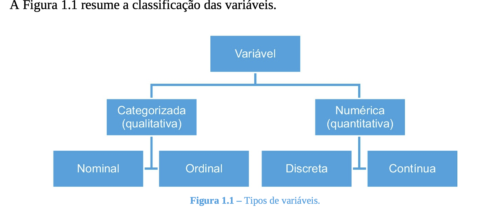

class: middle
##Introdução


- Na aula de hoje será visto basicamente alguns fundamentos de  manipulação e visualização de dados no software R.

- Manipulação consiste em fazer a  limpeza e formatação dos dados.

- Visualização consiste na elaboração de gráficos.

---
class: middle
##Ciclo da análise de dados

```{r, message = FALSE, warning = FALSE, echo = FALSE}

library(tidyverse)
library(knitr)
library(kableExtra)

```


####Nessa aula, o objetivo é aprender a arrumar (tidy), transformar e visualizar os dados.

[Fonte:](https://r4ds.had.co.nz/explore-intro.html)


---
class: middle
##Conceito de dados organizados no R

- **Dado:** é a informação coletada e registrada, referente a uma variável (VIEIRA, 2018).

- **Variável:** é uma condição ou característica que descreve uma pessoa, um animal, um lugar, um objeto, uma ideia.
A variável pode assumir valores diferentes em diferentes unidades (VIEIRA, 2018).


- Existem três regras inter-relacionadas que tornam um conjunto de dados organizado:

- Cada variável deve ter sua própria coluna.

- Cada observação deve ter sua própria linha.

- Cada valor deve ter sua própria célula.


---
class: middle
##Dados e Variáveis



Fonte: VIEIRA, 2018.

---
class: middle
##Exemplo: Associações entre variáveis relacionadas ao diabetes em mulheres indígenas do povo Pima

- Por muitos anos, os cientistas questionaram por que tantas mulheres indígenas dos povos Pima sofrem de diabetes em relação a outras etnias.

###Hipóteses Principais do Estudo

- Existe uma diferença nas médias para o índice de massa corporal (IMC) e número de gestações para aqueles que testaram positivo e aqueles que testaram negativo para diabetes ?

- Existe uma relação entre os resultados do teste para diabetes e o pedigree das nativas?


---
class: middle
##Variáveis do banco de dados

- `Pregnancies`: (Número de Gestações)

- `Glucose`: (Medição de Glicose)

- `BloodPressure`: (Pressão Sanguínea)

- `SkinThickness`: (Espessura da Pele)

- `Insulin`: (Insulina)

- `BMI`: (Índice de Massa Corporal)

- `DiabetesPedigreeFunction`: (Função definida como uma síntese da história de diabetes mellitus em parentes e a relação genética desses parentes com o sujeito. )

- `Age`: (Idade)


---
class: middle

##Tidyverse

- O pacote `tidyverse` do software estatístico `R` é utilizado para importar, manipular
e visualizar dados no R.

- Para instalar o pacote, podemos usar o seguinte comando

```{r, eval = FALSE, message = FALSE, warning = FALSE}

install.packages("tidyverse")

```

[Fonte:](https://r4ds.had.co.nz/explore-intro.html)

##Importar dados


```{r, eval = FALSE, message = FALSE, warning = FALSE}

dat = read.csv("diabetes.csv", header = TRUE)

```

```{r, echo = FALSE, message = FALSE, warning = FALSE}

dat = read.csv("diabetes.csv", header = TRUE)

```


---
class: middle

##Visão geral do data.frame()

- A função `glimpse()` fornece uma visão geral do `data.frame()`


```{r,  message = FALSE, warning = FALSE}

glimpse(dat)
```


---
class: middle

##Introdução a manipulação de dados - Uso da biblioteca `dplyr`

- A biblioteca `dplyr` faz parte do conjunto de bibliotecas `tidyverse`. Na prática,
quando o usuário instala o `tidyverse` a biblioteca `dplyr` já estará instalada.

- O principal objetivo da biblioteca `dplyr` é fazer manipulação de dados.

##dplyr - Principais funções

- `filter()` - filtra linhas

- `select()` - seleciona colunas

- `mutate()` - cria/modifica colunas

- `arrange()` - ordena a planilha

- `summarise()` - calcula algumas medidas resumo no conjunto de dados.


---
class: middle

##Usando a função filter()

- Selecione apenas as linhas em que o número de gestações seja maior do que 2

```{r, eval = FALSE, message = FALSE, warning=FALSE}

filter(dat, Pregnancies > 2)

```


- Selecione apenas as linhas em que o número de gestações seja maior do que 2 e glicose menor do que 126

```{r, eval = FALSE, message = FALSE, warning=FALSE}

filter(dat, Pregnancies > 2 & Glucose < 126)

```


- Selecione apenas as linhas em que o nível de insulina seja igual a zero

```{r, eval = FALSE, message = FALSE, warning=FALSE}

filter(dat, Insulin == 0)

```


---
class: middle

##Usando a função filter()

- Selecione apenas as linhas em que o número de gestações seja maior do que 2

```{r, echo = FALSE, message = FALSE, warning=FALSE}

filter(dat, Pregnancies > 2)

```

---
class: middle

##Usando a função filter()

- Selecione apenas as linhas em que o número de gestações seja maior do que 2 e glicose menor do que 126

```{r, echo = FALSE, message = FALSE, warning=FALSE}

filter(dat, Pregnancies > 2 & Glucose < 126)

```

---
class: middle

##Usando a função filter()

- Selecione apenas as linhas em que o nível de insulina seja igual a zero

```{r, echo = FALSE, message = FALSE, warning=FALSE}

filter(dat, Insulin == 0)

```


---
class: middle

##Usando a função select()


- Selecione apenas as colunas referentes a glicose

```{r, eval = FALSE, message = FALSE, warning=FALSE}

select(dat, Glucose)

```


- Selecione todas as variáveis que inicia com B

```{r, eval = FALSE, message = FALSE, warning=FALSE}

select(dat, starts_with("B"))

```


- Selecione apenas as colunas referentes a glicose, e pressão sanguínea

```{r, eval = FALSE, message = FALSE, warning=FALSE}

vars = c("Glucose", "Pregnancies", "Insulin")

select(dat, one_of(vars))

```


---
class: middle

##Usando a função select()


- Selecione apenas as colunas referentes a glicose

```{r, echo = FALSE, message = FALSE, warning=FALSE}

select(dat, Glucose)

```


---
class: middle

##Usando a função select()


- Selecione todas as variáveis que inicia com B

```{r, echo = FALSE, message = FALSE, warning=FALSE}

select(dat, starts_with("B"))

```


---
class: middle

##Usando a função select()

- Selecione apenas as colunas referentes a glicose, e pressão sanguínea

```{r, echo = FALSE, message = FALSE, warning=FALSE}

vars = c("Glucose", "Pregnancies", "Insulin")

select(dat, one_of(vars))

```


---
class: middle

##Usando a função select()


- Selecione apenas as colunas referentes a glicose, e pressão sanguínea

```{r, echo = FALSE, message = FALSE, warning=FALSE}

vars = c("Glucose", "Pregnancies", "Insulin")

select(dat, one_of(vars))

```


---
class: middle


##Usando a função mutate()

- Transformar a variável resultados (Outcome) em uma variável categorica

```{r, eval = FALSE, message = FALSE, warning=FALSE}

mutate(dat, Outcome = factor(Outcome))  %>% glimpse()

```


- Calcule transformar as medidas de glicose em escala logaritmica


```{r, eval = FALSE, message = FALSE, warning=FALSE}

mutate(dat, lGlucose = log(Glucose))  %>% select(Glucose, lGlucose)

```


- Vamos criar uma nova variável denominada $QUICKI = \frac{1}{\log{\mbox{insulina}} + \log{\mbox{glicose}}}$. 

```{r, eval = FALSE, message = FALSE, warning=FALSE}

mutate(dat, QUICKI =  1 / (log10(Glucose) + log10(Insulin)))  %>% select(Glucose,Insulin, QUICKI)

```

[Fonte:](https://www.scielo.br/scielo.php?script=sci_arttext&pid=S0004-27302006000200007#:~:text=A%20interpreta%C3%A7%C3%A3o%20do%20KITT,maior%20a%20sensibilidade%20%C3%A0%20insulina.)


- O comando %>%  encaminhará um valor, ou o resultado de uma expressão, para a próxima  de função


---
class: middle


##Usando a função mutate()

- Transformar a variável resultados (Outcome) em uma variável categorica

```{r, echo = FALSE, message = FALSE, warning=FALSE}

mutate(dat, Outcome = factor(Outcome))  %>% glimpse()

```


---
class: middle


##Usando a função mutate()


- Calcule transformar as medidas de glicose em escala logaritmica


```{r, echo = FALSE, message = FALSE, warning=FALSE}

mutate(dat, lGlucose = log(Glucose)) %>% select(Glucose, lGlucose)

```


---
class: middle


##Usando a função mutate()


- Vamos criar uma nova variável denominada $QUICKI = \frac{1}{\log{\mbox{insulina}} + \log{\mbox{glicose}}}$. 

```{r, echo = FALSE, message = FALSE, warning=FALSE}

mutate(dat, QUICKI =  1 / (log10(Glucose) + log10(Insulin)))  %>% select(Glucose,Insulin, QUICKI)

```


---
class: middle

##Usando a função arrange()

- Ordenar o conjunto de dados de forma crescente pela coluna  número de gestações


```{r, eval = FALSE, message = FALSE, warning=FALSE}

arrange(dat, Pregnancies)

```


- Ordenar o conjunto de dados de forma decrescente pela coluna  número de gestações 


```{r, eval = FALSE, message = FALSE, warning=FALSE}

arrange(dat, desc(Pregnancies))

```


- Ordenar o conjunto de dados de forma crescente pela colunas  número de gestações, glicose e pressão sanguínea


```{r, eval= FALSE, message = FALSE, warning=FALSE}

arrange(dat, Pregnancies, Glucose, BloodPressure )

```


---
class: middle

##Usando a função arrange()

- Ordenar o conjunto de dados de forma crescente pela coluna número de gestações 


```{r, echo = FALSE, message = FALSE, warning=FALSE}

arrange(dat, Pregnancies)

```


---
class: middle

##Usando a função arrange()

- Ordenar o conjunto de dados de forma decrescente pela coluna número de gestações


```{r, echo = FALSE, message = FALSE, warning=FALSE}

arrange(dat, desc(Pregnancies))

```


---
class: middle

##Usando a função arrange()

- Ordenar o conjunto de dados de forma crescente pela colunas número de gestações, glicose e pressão sanguínea

```{r, echo= FALSE, message = FALSE, warning=FALSE}

arrange(dat, Pregnancies, Glucose, BloodPressure )

```


---
class: middle

##Usando a função summarise()

- Essa função calcula algumas medidas resumo no conjunto de dados. Normalmente,
ela é utilizada em conjunto com a função `group_by()`.

- Vamos calcular a frequencia absoluta dos grupos que testaram positivo e o grupo que testaram negativo

```{r, eval= FALSE, message = FALSE, warning=FALSE}

group_by(dat, Outcome) %>% summarise(freq.abs = n())

```


- Vamos calcular a média do Indice de Massa Corporal para os grupos que testaram positivo e o grupo que testaram negativo

```{r, eval= FALSE, message = FALSE, warning=FALSE}

group_by(dat, Outcome) %>% summarise(IMC_medio = mean(BMI))

```


---
class: middle

##Usando a função summarise()


- Vamos calcular a frequencia absoluta dos grupos que testaram positivo e o grupo que testaram negativo

```{r, echo= FALSE, message = FALSE, warning=FALSE}

group_by(dat, Outcome) %>% summarise(freq.abs = n())

```


---
class: middle

##Usando a função summarise()

- Vamos calcular a média do Indice de Massa Corporal para os grupos que testaram positivo e o grupo que testaram negativo

```{r, echo= FALSE, message = FALSE, warning=FALSE}

group_by(dat, Outcome) %>% summarise(IMC_medio = mean(BMI))

```

---
class: middle

##Visualizar dados

- "Um gráfico simples traz mais informações à mente do analista de dados do que qualquer outro tipo de análise." - John Tukey

- Uma boa visualização mostrará coisas que você não esperava ou levantará novas questões sobre os dados.

- Uma boa visualização também pode indicar que você está fazendo a pergunta errada ou precisa coletar dados diferentes.

[Fonte:](https://r4ds.had.co.nz/explore-intro.html)


---
class: middle

##Alguns tipos de gráficos

.pull-left[

###Gráficos de Barras

- Gráficos de Barras são apropriados para apresentar dados qualitativos ou quantitativos discretos (poucas classes).

]

.pull-right[

```{r, echo= FALSE, message = FALSE, warning=FALSE}


ggplot(dat) + aes(x = Outcome) +
  geom_bar(fill = "#0c4c8a", aes(y = ..prop..)) +
  labs(x = "Positivo e Negativo", y = "Freq. Relativa", 
       subtitle = "Mulheres do Povo Pima", caption = "Gráfico de Barras") +
theme_bw()

```

]


---
class: middle

##Alguns tipos de gráficos

.pull-left[

###Histogramas

- Um tipo especial de gráfico  para representam a frequência de dados quantitativos contínuos que foram organizados em intervalos.

]

.pull-right[

```{r, echo= FALSE, message = FALSE, warning=FALSE}


ggplot(dat) +
 aes(x = BMI) +
 geom_histogram(bins = 37L, aes(y = ..density..), fill = "#0c4c8a") +
 labs(x = "Insulina", y = "Densidade", title = "Histograma  ") +
 theme_bw()

```

]


---
class: middle

##Alguns tipos de gráficos

.pull-left[

###Gráfico de Caixas

- Um gráfico de caixa  é um diagrama que resume os dados por
dividindo-o em quatro partes (quartis).

]

.pull-right[

```{r, echo= FALSE, message = FALSE, warning=FALSE}


ggplot(dat) +
 aes(x = "", y = BMI) +
 geom_boxplot(fill = "#0c4c8a") +
 labs(y = "IMC", title = "Gráfico de Caixa") +
 theme_minimal()
```

]


---
class: middle

##Alguns tipos de gráficos

.pull-left[

###Gráficos de Caixa para verficar relação entre variáveis quantitativas e qualitativas

- Agora vamos visualizar os dados para responder a seguinte pergunta:

- Existe uma diferença no valor da mediana para o índice de massa corporal (IMC) e número de gestações para aqueles que testaram positivo e aqueles que testaram negativo para diabetes ?

]

.pull-right[

```{r, echo= FALSE, message = FALSE, warning=FALSE}


ggplot(dat) +
 aes(x = Outcome, y = BMI) +
 geom_boxplot(fill = "#0c4c8a") +
 labs(caption = "Comparação de IMC para grupos com diagnostico positivo e negativo para diabetes") +
 theme_minimal()

```

]


---
class: middle

##Alguns tipos de gráficos

.pull-left[

###Gráfico de Dispersão

- Um gráfico de dispersão  é um tipo de gráfico que usa coordenadas cartesianas para exibir valores de duas variáveis. Útil para verificar a relação entre as variáveis quantitativas.

]

.pull-right[

```{r, echo= FALSE, message = FALSE, warning=FALSE}


ggplot(dat) +
 aes(x = Insulin, y = Glucose) +
 geom_point(size = 1L, colour = "#0c4c8a") +
 theme_minimal()

```

]


---
class: middle

##Visualização de dados no R

- Existem inúmeras formas de fazer visualização de dados no R.

- Nesta aula, apresentamos a biblioteca `esquisse`.

- Para instalar a biblioteca, podemos usar `install.package("esquisse")`

- Para usar a biblioteca, devemos carregar a biblioteca `library(esquisse)`, e para inicializar a biblioteca  usamos `esquisser()`.

- Maiores detalhes, podem ser vistos [aqui](https://dreamrs.github.io/esquisse/articles/get-started.html) e
[aqui](https://cran.r-project.org/web/packages/esquisse/vignettes/get-started.html).


---
##Referências

- WICKHAM, H.; GROMULRMUND, G. R for Data Science, 2017. O'Reilly Media. Disponível em: https://r4ds.had.co.nz/explore-intro.html. Acesso em: 26 de nov. de 2020.

- Instalação. CURSO-R. [2018?] Disponível em: <http://material.curso-r.com/instalacao/>. Acesso em: 20 de nov. de 2020.

- VIEIRA, S. Bioestatística. Tópicos Avançados. 4 edição. 2018

